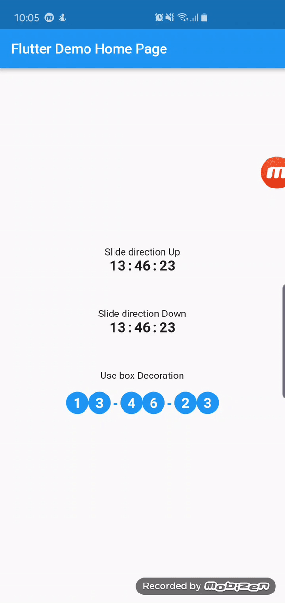

# slide_countdown_clock

A Countdown clock with slide up and down animation plugin for Flutter

## Demo


## Usage
To use plugin, just import package `import 'package:slide_countdown_clock/slide_countdown_clock.dart';`

## Example
You can check example directory to know how to use it like the demo gif.

```dart
import 'package:flutter/material.dart';
import 'package:slide_countdown_clock/slide_countdown_clock.dart';

void main() => runApp(MyApp());

class MyApp extends StatelessWidget {
  @override
  Widget build(BuildContext context) {
    return MaterialApp(
      title: 'Flutter Demo',
      theme: ThemeData(
        primarySwatch: Colors.blue,
      ),
      home: MyHomePage(title: 'Flutter Demo Home Page'),
    );
  }
}

class MyHomePage extends StatefulWidget {
  MyHomePage({Key key, this.title}) : super(key: key);

  final String title;

  @override
  _MyHomePageState createState() => _MyHomePageState();
}

class _MyHomePageState extends State<MyHomePage> {
  GlobalKey<ScaffoldState> _scaffoldKey = GlobalKey();
  Duration _duration = Duration(seconds: 1000000);

  @override
  Widget build(BuildContext context) {
    return Scaffold(
      key: _scaffoldKey,
      appBar: AppBar(title: Text(widget.title)),
      body: Center(
        child: Column(
          mainAxisSize: MainAxisSize.min,
          crossAxisAlignment: CrossAxisAlignment.center,
          mainAxisAlignment: MainAxisAlignment.center,
          children: <Widget>[
            Text('Slide direction Up'),
            SlideCountdownClock(
              duration: Duration(days: 20, minutes: 1000000),
              slideDirection: SlideDirection.Up,
              separator: ":",
              textStyle: TextStyle(
                fontSize: 20,
                fontWeight: FontWeight.bold,
              ),
              shouldShowDay: true,
              onDone: () {
                _scaffoldKey.currentState.showSnackBar(SnackBar(content: Text('Clock 1 finished')));
              },
            ),
            _buildSpace(),
            Text('Slide direction Down'),
            SlideCountdownClock(
              duration: _duration,
              slideDirection: SlideDirection.Down,
              separator: ":",
              textStyle: TextStyle(
                fontSize: 20,
                fontWeight: FontWeight.bold,
              ),
              onDone: () {
                _scaffoldKey.currentState.showSnackBar(SnackBar(content: Text('Clock 1 finished')));
              },
            ),
            _buildSpace(),
            Text('Use box Decoration'),
            Padding(
              padding: EdgeInsets.all(10),
              child: SlideCountdownClock(
                duration: _duration,
                slideDirection: SlideDirection.Up,
                separator: "-",
                textStyle: TextStyle(
                  fontSize: 20,
                  fontWeight: FontWeight.bold,
                  color: Colors.white,
                ),
                separatorTextStyle: TextStyle(
                  fontSize: 20,
                  fontWeight: FontWeight.bold,
                  color: Colors.blue,
                ),
                padding: EdgeInsets.all(10),
                decoration: BoxDecoration(color: Colors.blue, shape: BoxShape.circle),
                onDone: () {
                  _scaffoldKey.currentState.showSnackBar(SnackBar(content: Text('Clock 1 finished')));
                },
              ),
            ),
          ],
        ),
      ),
    );
  }

  Widget _buildSpace() {
    return SizedBox(height: 50);
  }
}

```
